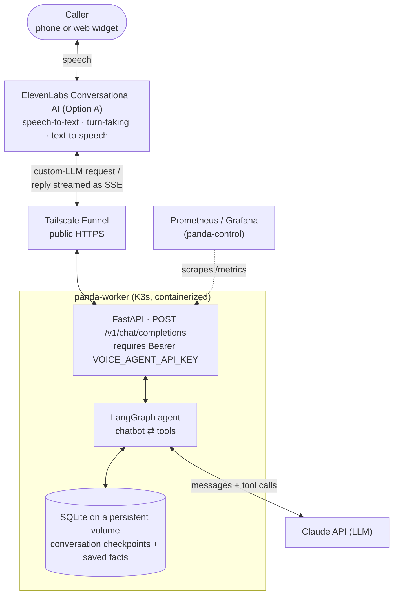

# Voice Agent


-326CE5?logo=kubernetes&logoColor=white)

## Project Overview

A LangChain / LangGraph agent that acts as the brain behind an AI voice
assistant. The voice SaaS provider handles the phone/web call, transcription,
turn-taking, and speech; this service owns the reasoning — state, tools, memory,
and routing — and is exposed to the provider as an OpenAI-compatible "custom
LLM" endpoint.

It is the application-layer companion to the `bare-metal-mlops-sandbox` cluster:
that project built the bare-metal K3s infrastructure; this one runs a real
workload on it. The agent deploys as a containerized service on `panda-worker`,
served from the cluster's local Docker registry and observed by its
Prometheus / Grafana stack.

## Architecture



The provider front end is swappable — ElevenLabs now (Option A), Vapi or Retell
later (Option B) — because all three call the same `/v1/chat/completions`
contract. See [docs/providers.md](docs/providers.md).

## Stack

- **Orchestration:** LangGraph (explicit `StateGraph`)
- **LLM:** Claude (via `langchain-anthropic`)
- **Serving:** FastAPI + Uvicorn, OpenAI-compatible custom-LLM endpoint
- **Voice (Option A):** ElevenLabs Conversational AI
- **Deploy:** Docker image to the cluster's local registry, runs on `panda-worker`
- **Observability:** Prometheus `/metrics`, scraped by `panda-control`

## Quickstart (local, no voice provider)

```bash
python -m venv .venv && source .venv/bin/activate
pip install -e .
cp .env.example .env        # set ANTHROPIC_API_KEY and VOICE_AGENT_API_KEY
voice-agent-chat            # text REPL against the LangGraph agent
```

Run the HTTP endpoint locally. Requests need the `VOICE_AGENT_API_KEY`
from `.env` as a Bearer token (the server rejects everything while it's unset):

```bash
uvicorn voice_agent.server:app --reload --port 8080
export VOICE_AGENT_API_KEY=$(grep '^VOICE_AGENT_API_KEY=' .env | cut -d= -f2-)
curl -s localhost:8080/v1/chat/completions \
  -H "Authorization: Bearer $VOICE_AGENT_API_KEY" \
  -H 'content-type: application/json' \
  -d '{"messages":[{"role":"user","content":"hello"}]}' | jq
```

Prove the streaming round-trip the way ElevenLabs will call it (real
token-by-token SSE, terminated by `[DONE]`):

```bash
python scripts/elevenlabs_sim.py "what time is it in Tokyo?"
```

See [docs/providers.md](docs/providers.md) for the custom-LLM contract and the
steps to go live against a real ElevenLabs agent.

## Exposing it publicly (Tailscale Funnel)

The voice provider calls the agent from the internet, so `panda-worker`
publishes it with Tailscale Funnel. Publish **only `/v1`**: `/health` and
`/metrics` are unauthenticated (for Kubernetes probes and Prometheus, which
reach them inside the cluster), and Funnel would otherwise expose them too.

On `panda-worker`:

```bash
sudo tailscale funnel --bg --set-path=/v1 http://127.0.0.1:30880/v1
tailscale funnel status     # |-- /v1 proxy http://127.0.0.1:30880/v1
```

Funnel strips the mount path before proxying, so the target must end in `/v1`
for `/v1/chat/completions` to reach the server unchanged. `30880` is the fixed
NodePort from `deploy/k3s/voice-agent.yaml`. Changes can take a few seconds to
go live.

Check from any machine (`<funnel-host>` is the node's `*.ts.net` name):

```bash
curl -s -o /dev/null -w '%{http_code}\n' -X POST https://<funnel-host>/v1/chat/completions  # 401
curl -s -o /dev/null -w '%{http_code}\n' https://<funnel-host>/metrics                     # 404
```

## Roadmap

| # | Milestone | Status |
|---|---|---|
| 1 | LangGraph agent + local text REPL | Done |
| 2 | Tools and persistent memory (checkpointer) | Done |
| 3 | OpenAI-compatible custom-LLM endpoint (FastAPI) | Done |
| 4 | Connect ElevenLabs Conversational AI, text round-trip | Done |
| 5 | Containerize and deploy to panda-worker via local registry | Done |
| 6 | Tailscale Funnel exposes the webhook to the provider cloud | Done |
| 7 | Turn latency / token-cost metrics in Grafana | Done |
| 8 | Live voice call: STT -> brain -> TTS round-trip via phone/widget | Done |
| 9 | Option B: front with Vapi or Retell (config-only) | Future |

## Layout

```
src/voice_agent/
  agent.py        LangGraph StateGraph + persistent SQLite checkpointer
  tools.py        agent tools (time, timezone, calculator, remember/recall)
  memory_store.py SQLite-backed long-term facts (cross-conversation memory)
  server.py       FastAPI OpenAI-compatible endpoint, token streaming + /metrics
  chat.py         local text REPL (stable thread, persists across restarts)
  config.py       env-driven settings
scripts/          elevenlabs_sim.py — replay the provider's request locally
deploy/k3s/       Deployment (pinned to panda-worker) + Service + ServiceMonitor +
                  Grafana dashboard ConfigMap + Secret example
docs/             provider integration notes
data/             local SQLite state (gitignored)
```
