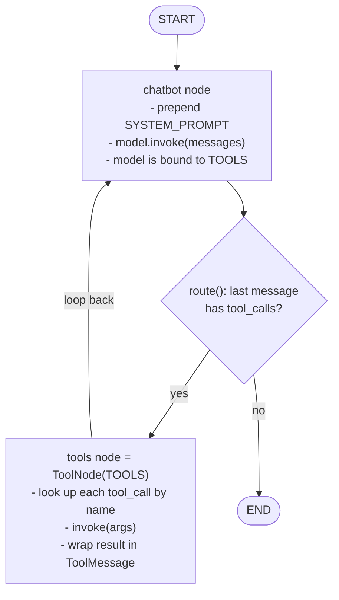
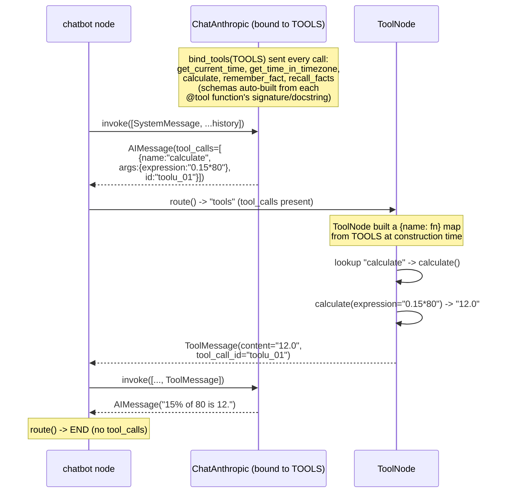
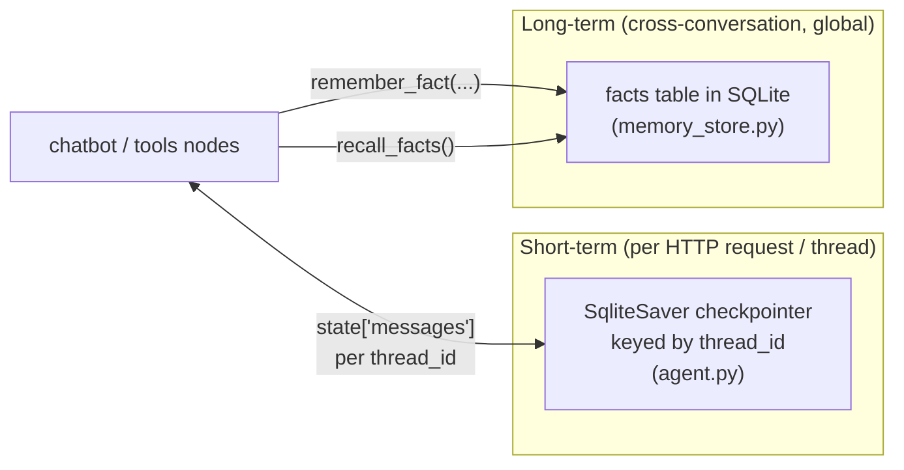
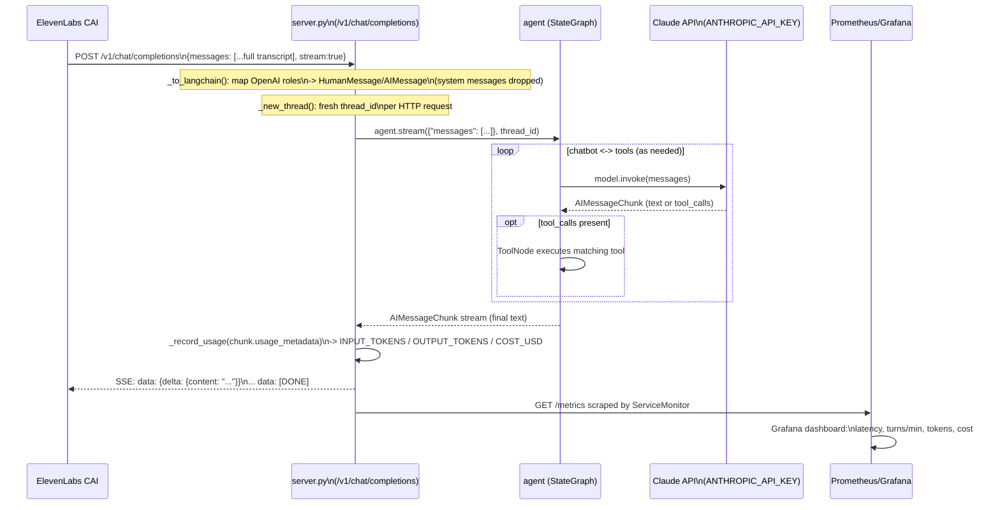

# LangGraph / LangChain Architecture

How `agent.py` and `server.py` fit together — the graph, the tool-routing
mechanism, and the two memory layers.

## 1. The StateGraph (`agent.py`)

- **State** = `MessagesState`, basically `{"messages": [...]}`. Each node
  returns new messages and LangGraph appends them via the `add_messages`
  reducer — nodes never manage the full list themselves.
- **`chatbot`** always prepends the fixed `SYSTEM_PROMPT`, then calls Claude
  (`ChatAnthropic(...).bind_tools(TOOLS)`).
- **`route`** is a pure yes/no gate: does the latest `AIMessage` carry
  `tool_calls`? It does *not* decide which tool — only whether to detour
  through `tools` at all.
- **`tools` = `ToolNode(TOOLS)`** does the actual dispatch (see §2).
- **`tools -> chatbot`** loops back so Claude can see tool results and either
  call another tool or produce a final text reply.

## 2. How Claude picks a tool (`tools.py`)

Adding tool #6 = write an `@tool` function in `tools.py` and append it to
`TOOLS`. Nothing in `agent.py` changes — `bind_tools`, `ToolNode`, and
`route()` are all generic over the list.

## 3. Two memory layers

- **Checkpointer**: full message history per `thread_id`. In `chat.py` (local
  REPL) the thread is stable, so it really persists a conversation across
  restarts.
- **`memory_store`**: a separate `facts` table, written/read only via the
  `remember_fact` / `recall_facts` tools. Global, not scoped per thread.

## 4. End-to-end request (ElevenLabs -> Claude -> ElevenLabs)

Key point: from `server.py`'s perspective, **every request is stateless** —
the provider resends the full transcript each turn, so the only thing that
truly persists across separate HTTP calls is `memory_store`'s `facts` table
(via `remember_fact`/`recall_facts`). The checkpointer's per-thread state is
created fresh each request and never reused.
